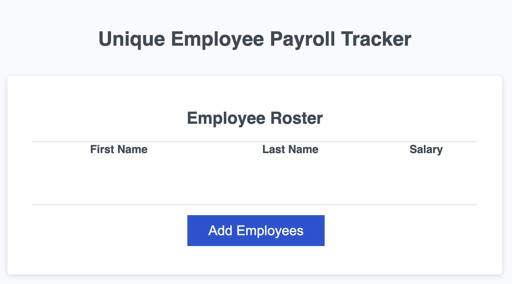

<h1 id="title">ReadMe file for "A Unique Empoloyee Payroll Tracker"</h1>
<h3>By User davehyler</h3>
<!-- Optional Screenshot will show if user places one within the same directory as this readme. -->

 
<nav>
<h2>Table Of Contents</h2>
<ol>
<li><a href="#title">Title</a></li>
<li><a href="#username">Username</a></li>
<li><a href="#email">Email</a></li>
<li><a href="#stack">Stack</a></li>
<li><a href="#license">License</a></li>
<li><a href="#description">Description</a></li>
<li><a href="#instructions">Instructions</a></li>
<li><a href="#usage">Usage</a></li>
<li><a href="#guidelines">Guidelines</a></li>
<li><a href="#testing">Testing</a></li>
</ol>
</nav>
<ul class="list-group">
<h2>Project Information</h2>
<h3 id="stack">Stack used:</h3>

HTML,JavaScript,CSS

<h3 id="license">License: MIT</h3>

Badge: 

<h3 id="description">Description of project:</h3>

This is a simple Employee Payroll Tracker)

<h3 id="instructions">Instructions:</h3>

Follow link below to deployed Website (https://davehyler.github.io/unique-employee-payroll-tracker/), press the only button on the body of the page, and follow all prompts.

<h3 id="usage">From source readme:</h3>

* `displayAverageSalary`: This function will take in the generated array of employees and log the average salary and number of employees to the console.  You should use a template literal string for this task.

* `getRandomEmployee`: This function will take in the generated array of employees, randomly select one employee, and use a template literal to log their full name to the console.  The built in `Math` object can help with random number generation: ([MDN Web Docs on `Math.random`](https://developer.mozilla.org/en-US/docs/Web/JavaScript/Reference/Global_Objects/Math/random))

* The provided starter code includes the `displayEmployees` and `trackEmployeeData` functions. These functions are complete and working. You do not have to modify any code for the following functions:

* `displayEmployees`: This function will take in an array of employees and render each employee to an HTML table.

* `trackEmployeeData`: This function will execute when the "Add Employees" button is clicked. It will take the array generated in your `collectEmployees` function, sort the employees by last name, and place them on a table on the page using the provided `displayEmployees` function.  Additionally, the function will execute the `displayAverageSalary` function to log the average employee salary to the console, and execute the `getRandomEmployee` function to log a random employees information to the console.

<h3 id="guidelines">Guidelines for Contribution:</h3>

To contribute, please upload your code or alterations to a commit and it will be reviewed.

<h3 id="testing">Tests</h3>

N/A. If you would like to write a test for these functions, feel free.

</ul>
<h3>Questions? Contact Me:</h3>
<ul class="list-group">
<li class="list-group-item" id="username">GitHub username: davehyler</li>
<li class="list-group-item" id="email">Email:  davehyler@github.com (placeholder since this is a publicly accessible and scrapable page)</li>
</ul>
<a href = "https://davehyler.github.io/unique-employee-payroll-tracker/">Launch Payroll Application Here</a>
